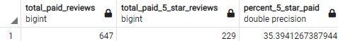
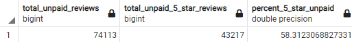

# Amazon_Vine_Analysis

## Overview
The purpose of this analysis is to determine if there is any bias toward favorable reviews from Vine members in the Beauty products dataset.

## Results

### Vine/Paid Analysis Results

### Non-Vine/Unpaid Analysis Results

- There are 647 Vine reviews and 74,113 non-Vine reviews.
- There are 229 Vine 5-star reviews and 43,217 non-Vine 5-star reviews. 
- The percentage of Vine reviews that were 5 stars out of the total Vine reviews is 35.34% and the percentage of non-Vine reviews that were 5 stars out of the total non-Vine reviews is 58.31%

## Summary
Since the percentage of 5-star Vine reviews, at 35.34%, is less than the percentage of non-Vine reviews, at 58.31%, there doesn't appear to be any positivity bias for reviews in the Vine program. An additional analysis that can be done to support the previous statement is to find the combined percentage of 4 and 5 star reviews for Vine reviews and compare them to the combined percentage of 4 and 5 star reviews for non-Vine reviews.
